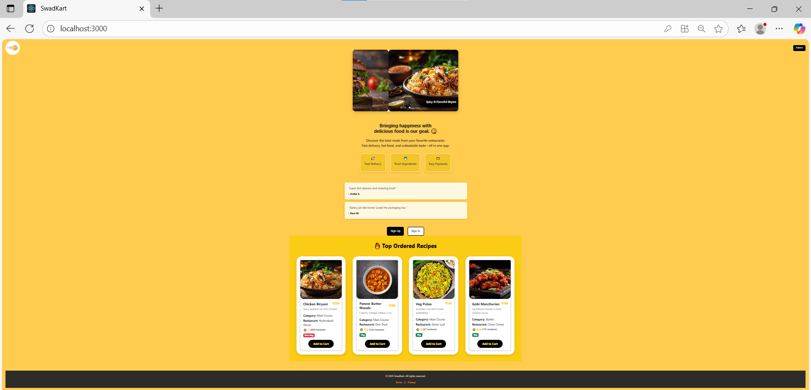
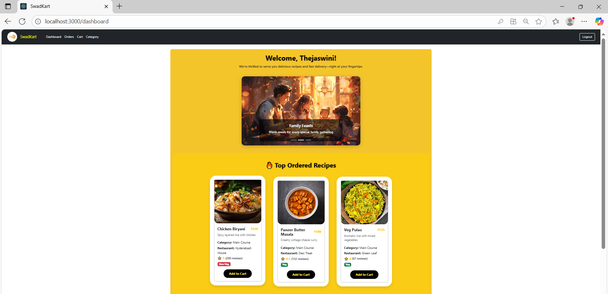
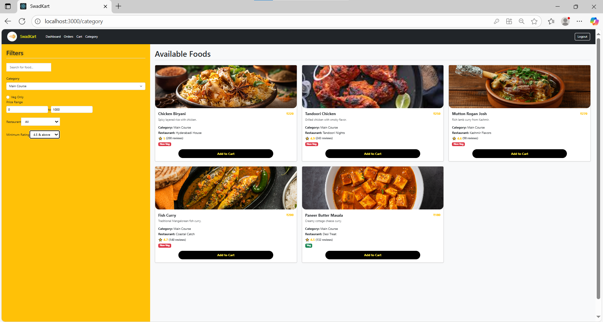
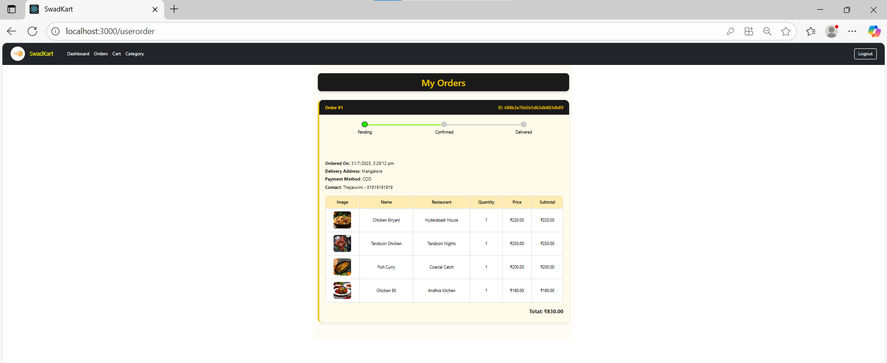
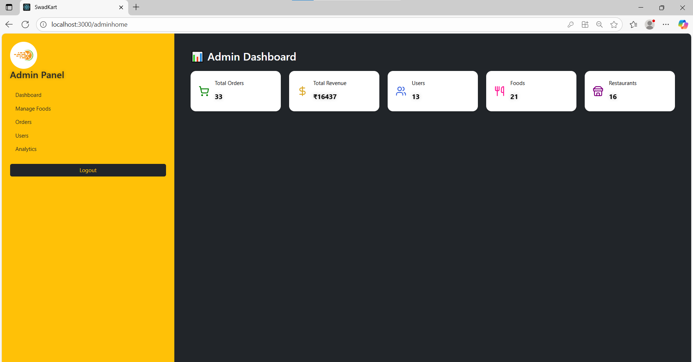
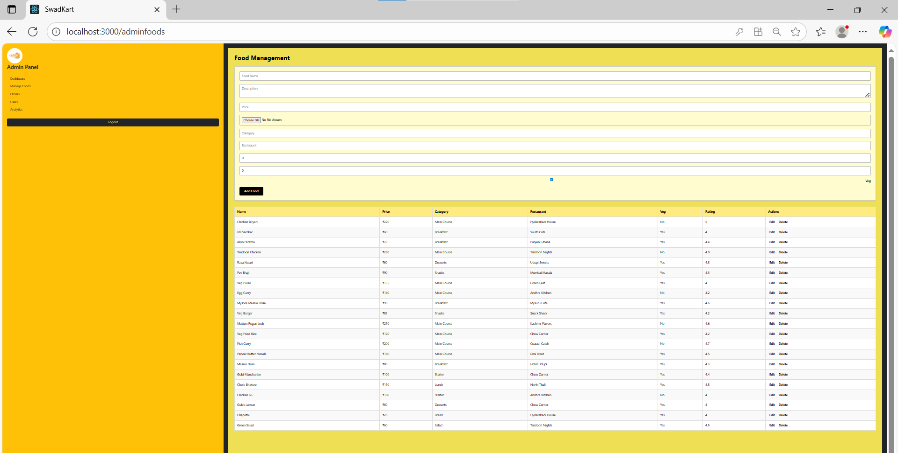
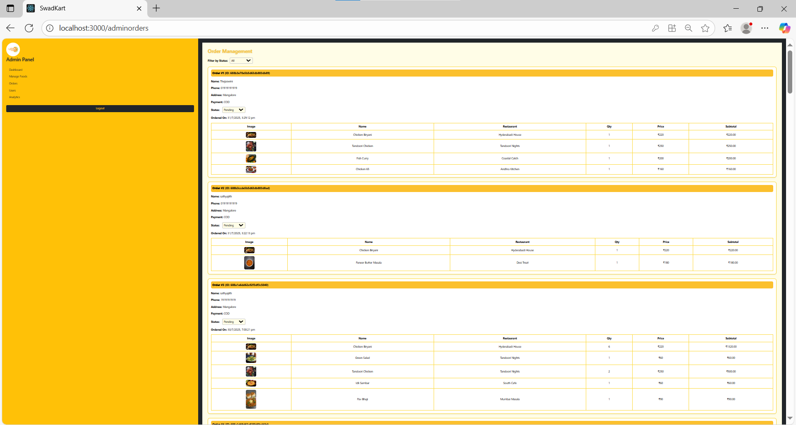
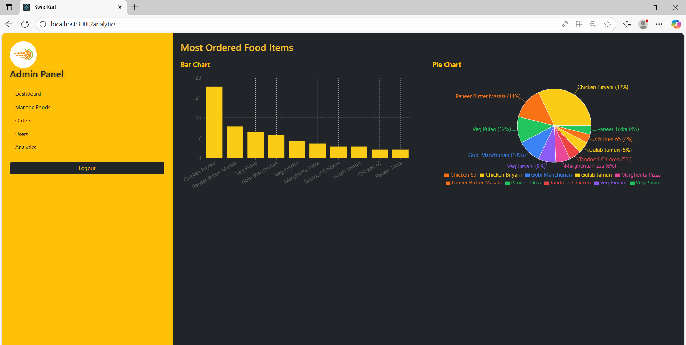

# 🍽️ SwadKart – Online Food Ordering App

SwadKart is a full-stack food ordering web application built with the MERN stack (MongoDB, Express, React, Node.js). It allows users to browse food categories, add items to cart, place orders, and make online payments via Razorpay.

---

## 🚀 Features

- 🔐 User Authentication (Signup / Login)
- 🍱 Browse foods by category (e.g., Main Course, Starters, Desserts, Salads)
- 🛒 Add to Cart, Modify Quantity, Remove Items
- 💳 Checkout with Cash on Delivery or Razorpay
- 📦 Order History with Status Tracking
- 🧾 Admin Panel (Manage Orders) 
- 🌐 Responsive UI with Bootstrap
- 🔔 Toast Notifications via `react-toastify`

---

## 🛠️ Tech Stack

### Frontend
- React
- Bootstrap 5
- React Router
- Axios
- React Toastify

### Backend
- Node.js
- Express.js
- MongoDB (with Mongoose)
- Razorpay SDK

---

## ⚙️ Getting Started

### 1. Clone the repository

git clone https://github.com/Thejaswinik19/swadkart.git
cd swadkart

### 2. Setup .env for server

Create a .env file inside the server/ folder:

PORT=5000
FRONTEND_URL=http://localhost:3000
MONGO_URI=your_mongo_connection_string
RAZORPAY_KEY_ID=your_razorpay_key_id
RAZORPAY_SECRET=your_razorpay_secret
IMAGE_BASE_URL=http://localhost:5000/images  (You must create a folder named images/ in your backend root directory.All food item images (uploaded or manually added) are stored here.)

### 3. Install Dependencies
#### server

cd server
npm install
node server.js

#### client

cd client
npm install
npm start

### Screenshots

## GitHub: Thejaswinik19

## 📄 License

This project is licensed under the [MIT License](LICENSE).